# Sistema de Gestión de Cadena de Suministro (SCM)

Proyecto académico — Patrones de Diseño de Software
Unidades Tecnológicas de Santander (UTS)
Docente: Eliecer Montero Ojeda, Ed.D.

## Descripción

Sistema para el seguimiento de productos desde el fabricante hasta el cliente
final, con optimización de rutas y almacenamiento, predicción de demanda
mediante análisis predictivo, e integración con IoT para monitoreo en
tiempo real.

## Objetivo general

Diseñar e implementar un sistema de gestión de cadena de suministro (SCM) basado en una arquitectura hexagonal modular, que permita el seguimiento de productos desde el fabricante hasta el cliente final, la optimización de rutas y almacenamiento, la predicción de demanda mediante análisis predictivo y la integración con dispositivos IoT para monitoreo en tiempo real, aplicando patrones de diseño GoF como estrategia de solución a los principales retos de extensibilidad, mantenibilidad y bajo acoplamiento del sistema.

## Objetivos específicos

1. Diseñar la arquitectura hexagonal del sistema, separando claramente dominio, aplicación, infraestructura e interfaces en cada uno de los módulos (`tracking`, `logistics`, `forecasting`, `iot`), de forma que el sistema quede preparado para una eventual migración a microservicios.

2. Implementar el módulo `tracking` para el registro y validación de eventos de seguimiento de productos a lo largo de la cadena de suministro, aplicando los patrones **Factory Method** (creación de eventos según tipo de sensor/etapa) y **Chain of Responsibility** (validación de eventos).

3. Implementar el módulo `logistics` para la optimización de rutas de distribución y almacenamiento, aplicando los patrones **Builder** (construcción de rutas complejas) y **Strategy** (algoritmos de optimización intercambiables).

4. Implementar el módulo `forecasting` para la predicción de demanda mediante análisis predictivo, aplicando los patrones **Decorator** (enriquecimiento de reportes) y **Command** (encapsulamiento de operaciones de generación y recálculo de pronósticos).

5. Implementar el módulo `iot` para la integración con dispositivos de distintos fabricantes y el monitoreo en tiempo real, aplicando los patrones **Adapter** (integración de dispositivos heterogéneos) y **Observer** (notificación de eventos en tiempo real).

6. Centralizar los servicios transversales de conexión a base de datos y autenticación en el módulo `shared`, aplicando el patrón **Singleton** para garantizar una única instancia del motor de base de datos y de la gestión de sesiones/JWT.

7. Garantizar la calidad del software mediante pruebas automatizadas (pytest, cobertura ≥ 80%) e integración continua (GitHub Actions), documentando las decisiones de diseño mediante ADRs y diagramas UML.

8. Contenerizar el sistema (Docker / docker-compose) para facilitar su despliegue y validar su viabilidad como base hacia una futura arquitectura de microservicios.

## Arquitectura

Monolito modular con **arquitectura hexagonal** por módulo (bounded context),
preparado para ser desplegado como microservicios independientes vía
`docker-compose`. Justificación completa en [`docs/adr/0001-arquitectura-y-stack.md`](docs/adr/0001-arquitectura-y-stack.md).

Módulos:

| Módulo | Responsabilidad |
|---|---|
| `tracking` | Seguimiento de productos fabricante → cliente final |
| `logistics` | Optimización de rutas y almacenamiento |
| `forecasting` | Predicción de demanda (análisis predictivo) |
| `iot` | Integración IoT y monitoreo en tiempo real |

Cada módulo sigue la estructura hexagonal:

```
src/<modulo>/
├── domain/          # Entidades, value objects, puertos (interfaces)
├── application/      # Casos de uso, patrones de comportamiento
├── infrastructure/    # Adaptadores: BD, mensajería, IoT, APIs externas
└── interfaces/        # Adaptadores de entrada: REST, CLI, eventos
```

## Stack tecnológico

- **Lenguaje:** Python 3.11
- **Framework API:** FastAPI
- **Pruebas:** pytest + pytest-cov (cobertura objetivo ≥ 80%)
- **CI/CD:** GitHub Actions
- **Monitoreo/Logging:** Prometheus + Grafana (por definir en infraestructura)
- **Contenedores:** Docker / docker-compose

## Patrones GoF planeados (mínimo 8, ≥2 por categoría)

Repartidos por dueño de módulo: cada integrante es responsable de 2 módulos
completos (dominio, aplicación, infraestructura, interfaces, pruebas y
documentación de esos módulos).

| Categoría | Patrón | Módulo | Uso previsto | Responsable |
|---|---|---|---|---|
| Creacional | Builder | `logistics` | Construcción de rutas de distribución complejas | Brayan Martínez |
| Creacional | Factory Method | `tracking` | Creación de eventos de tracking según tipo de sensor/etapa | Julián Niño |
| Estructural | Adapter | `iot` | Integración con dispositivos IoT de distintos fabricantes | Brayan Martínez |
| Estructural | Decorator | `forecasting` | Enriquecimiento de reportes de predicción de demanda | Julián Niño |
| Comportamiento | Strategy | `logistics` | Algoritmos de optimización de rutas intercambiables | Brayan Martínez |
| Comportamiento | Observer | `iot` | Notificación en tiempo real de eventos IoT | Brayan Martínez |
| Comportamiento | Chain of Responsibility | `tracking` | Validación de eventos de la cadena de suministro | Julián Niño |
| Comportamiento | Command | `forecasting` | Encapsular operaciones de generación/recálculo de pronósticos | Julián Niño |

(Sujeto a ajuste conforme avance el diseño; se documentará en UML y ADRs.)

### Dueños de módulo

| Módulo | Responsable principal |
|---|---|
| `logistics` | Brayan Martínez |
| `iot` | Brayan Martínez |
| `tracking` | Julián Niño |
| `forecasting` | Julián Niño |

Cada quien abre sus propias ramas `feature/<modulo>-...` desde `develop` para
trabajar en sus módulos, pero cualquiera puede hacer PR de revisión sobre el
módulo del otro.

## Cómo ejecutar (en construcción)

```bash
python -m venv .venv
source .venv/bin/activate
pip install -r requirements.txt
cp .env.example .env  # completar DATABASE_URL y JWT_SECRET_KEY reales
uvicorn src.main:app --reload
```

### Configuración (variables de entorno)

La app lee la configuración desde variables de entorno (con `.env` local vía
`python-dotenv`, que **no** se sube al repo). Ver [`.env.example`](.env.example)
para el listado completo:

| Variable | Uso | Default si no está definida |
|---|---|---|
| `DATABASE_URL` | Connection string de Postgres (local o en la nube, p.ej. Neon) | Postgres local (`localhost:5432/scm_db`) |
| `JWT_SECRET_KEY` | Clave para firmar/verificar los JWT | Clave de desarrollo, **no usar en producción** |
| `JWT_ALGORITHM` | Algoritmo de firma JWT | `HS256` |
| `JWT_EXPIRE_MINUTES` | Minutos de expiración del token | `60` |

Para usar una base de datos en la nube (Neon, Supabase, etc.) en vez de una
instalación local de Postgres, solo hay que definir `DATABASE_URL` en el
`.env` con la connection string que entregue el proveedor — el resto del
código (Singleton `DatabaseConnection`) no cambia.

## Pruebas

```bash
pytest --cov=src --cov-report=term-missing
```

## Estructura de commits

Este repositorio usa [Conventional Commits](https://www.conventionalcommits.org/es/v1.0.0/):
`feat`, `fix`, `docs`, `test`, `refactor`, `chore`, `ci`, `build`.

## Equipo

| Nombre | Módulos a cargo |
|---|---|
| Brayan Martínez | `logistics`, `iot` |
| Julián Niño | `tracking`, `forecasting` |

## Licencia

Uso académico — UTS.

## Patron Singleton


---

## Registro de avances — Módulo `shared` (conexión BD + autenticación)

### Base de datos
- Se implementó el patrón **Singleton** (`src/shared/database.py`) para centralizar la creación del `engine` de SQLAlchemy y el `sessionmaker`, garantizando una única instancia thread-safe (con `threading.Lock` y doble chequeo) reutilizada en toda la aplicación.
- Se agregó el endpoint `GET /health`, que ejecuta una consulta real (`SELECT 1`) contra PostgreSQL para verificar la conexión, en lugar de solo confirmar que el servidor está en pie.

### Autenticación (login y registro)
- Se implementó un endpoint `POST /login` con generación de tokens **JWT**, usando `python-jose`.
- El manejo de JWT también sigue el patrón **Singleton** (`src/shared/security.py`, clase `JWTManager`), centralizando la configuración (clave secreta, algoritmo, expiración) y el control de sesiones activas por usuario.
- Se agregó control de sesión duplicada: si un usuario ya tiene un token activo y vigente, un nuevo intento de login devuelve `409 Conflict` en vez de generar un token adicional.
- Los usuarios ya se persisten en una tabla real `users` de PostgreSQL (`src/shared/models.py`), con contraseñas hasheadas con `bcrypt` (`src/shared/password_hashing.py`) — ya no se usa el `FAKE_USER` en memoria.
- Al arrancar la app (`src/main.py`, `lifespan`), se crea la tabla `users` si no existe y se siembra un usuario `admin`/`admin123` si la tabla está vacía, para que las pruebas manuales (Postman, curl) funcionen sin pasos extra.
- Nuevo endpoint `POST /register` para crear usuarios adicionales (devuelve `409 Conflict` si el username ya existe).

### Cómo probarlo
```bash
# Verificar conexión a BD
GET http://127.0.0.1:8000/health

# Login (Postman / curl)
POST http://127.0.0.1:8000/login
Content-Type: application/json

{
  "username": "admin",
  "password": "admin123"
}

# Registrar un usuario nuevo
POST http://127.0.0.1:8000/register
Content-Type: application/json

{
  "username": "nuevo_usuario",
  "password": "clave123"
}
```

### Pendiente
- Endpoint de `logout` para invalidar sesión manualmente.
- Frontend separado (fuera de este backend) con diseño UX/UI, a construir después.
- Iniciar dominio de `forecasting` (Command).

---

## Módulo `tracking` — Patrón: Factory Method

**Responsable habitual del módulo:** Julián Niño (ver tabla de dueños de módulo).

Implementa el registro de eventos de seguimiento de productos en la cadena
de suministro, usando **Factory Method** para decidir qué tipo de evento
construir según el dato recibido (sensor IoT o cambio de etapa), tal como
lo pide el objetivo específico del módulo.

### Diseño
- `src/tracking/domain/entities.py`: `TrackingEvent` (base) y los productos
  concretos `SensorTrackingEvent` / `StageChangeTrackingEvent`.
- `src/tracking/domain/event_factory.py`: `TrackingEventCreator` (Creator
  abstracto) con `SensorEventCreator` y `StageChangeEventCreator` como
  subclases concretas — el patrón Factory Method en sí.
- `src/tracking/application/register_event.py`: caso de uso que resuelve el
  Creator adecuado y persiste el evento a través de un puerto de repositorio.
- `src/tracking/infrastructure/`: adaptador SQLAlchemy (`tracking_events`)
  que reutiliza la sesión de `get_db()` — es decir, el engine único de
  `DatabaseConnection` (Singleton) de `src/shared`. El Factory Method **no**
  crea su propia conexión ni se implementa como Singleton: son patrones
  distintos y se mantienen separados a propósito.
- `src/tracking/interfaces/api.py`: `POST /tracking/events` y
  `GET /tracking/events/{product_id}`.

### Cómo probarlo
```bash
# Evento de sensor
POST http://127.0.0.1:8000/tracking/events
Content-Type: application/json

{
  "event_type": "sensor",
  "product_id": "PROD-001",
  "stage": "transporte",
  "sensor_type": "temperatura",
  "reading_value": 4.5,
  "unit": "C"
}

# Evento de cambio de etapa
POST http://127.0.0.1:8000/tracking/events
Content-Type: application/json

{
  "event_type": "stage_change",
  "product_id": "PROD-001",
  "stage": "entrega",
  "previous_stage": "transporte",
  "responsible": "Transportista X"
}

# Historial de eventos de un producto
GET http://127.0.0.1:8000/tracking/events/PROD-001
```

### Pendiente
- Chain of Responsibility para validar los eventos antes de guardarlos
  (siguiente patrón planeado para este módulo).
- Los endpoints de tracking todavía no exigen JWT (igual que el resto de
  la API por ahora).

---

## Semana 3 — Patrón: Singleton

**Módulo:** `shared` (transversal a `tracking` y `forecasting`)
**Responsable:** Julián Niño

### Código
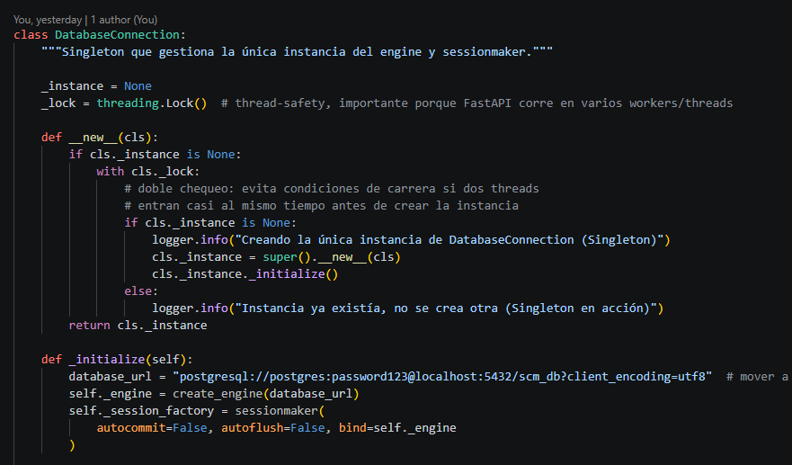
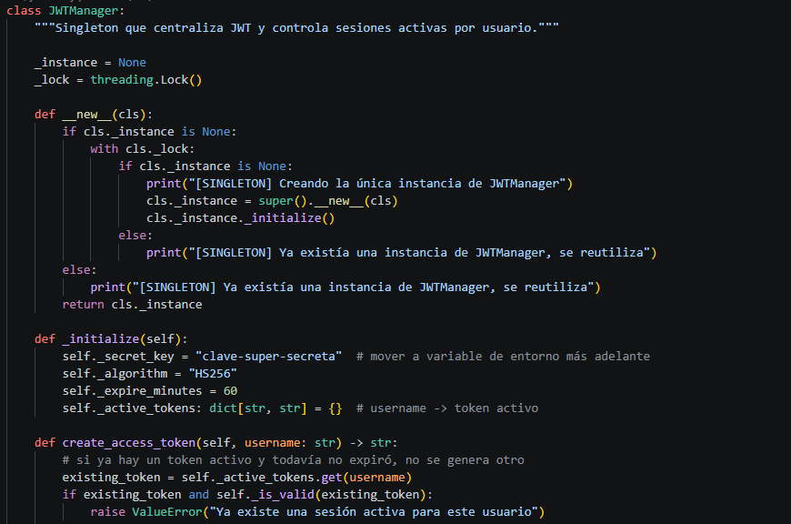


### Prueba de funcionamiento
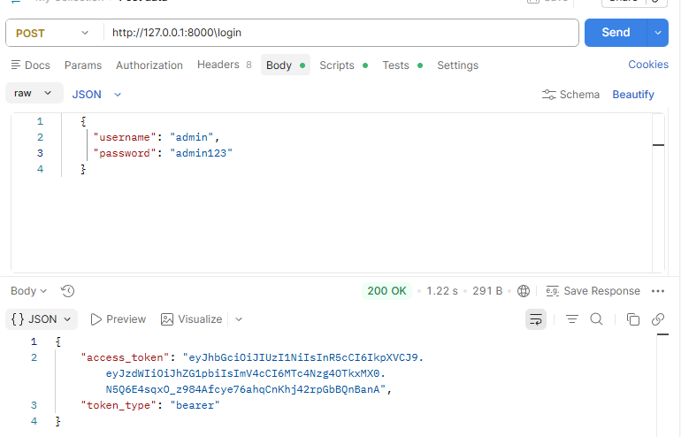

### Dónde se implementa
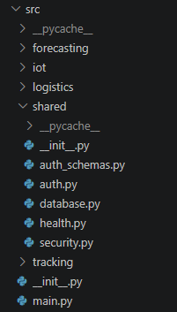

**Justificación:** se usa para garantizar una única instancia de conexión a BD / configuración JWT, compartida en toda la aplicación sin duplicar recursos.


---
## Semana 4
## Registro de avances — Módulo `tracking` (Abstract Factory)

### Contexto
- El **Factory Method** (implementado por el compañero de módulo) resuelve la **creación** del `TrackingEvent` según su tipo (`sensor` o `stage_change`).
- El **Abstract Factory** resuelve un problema distinto: el **procesamiento** del evento ya creado — construye una familia coherente de dos componentes (`validador` + `notificador`) según ese mismo tipo de evento, sin duplicar ni interferir con el Factory Method existente.

### Código
CLASE ABSCTRAC FACTORY
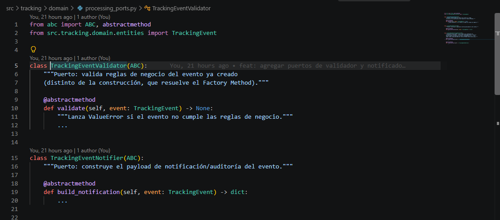

FAMILIA DE PROCESOS
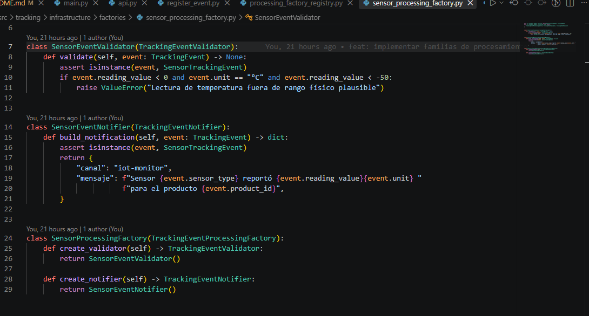

FACTORIES (SELECTOR)
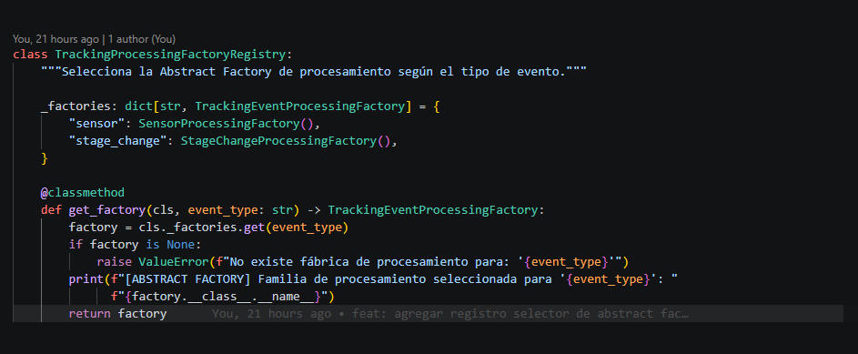

REGISTRO EVENTO
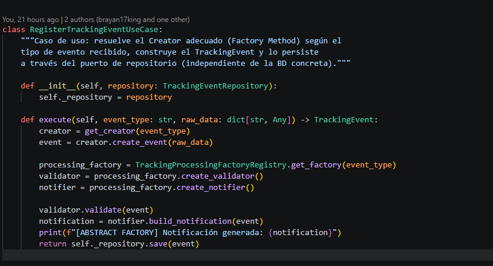

### Prueba de funcionamiento

PRUEBA DE LOGS EN CONSOLA
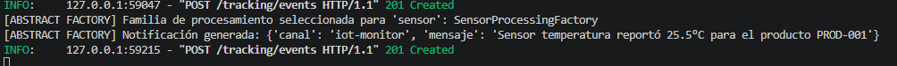

EJECUCIONES  EN POSTMAN
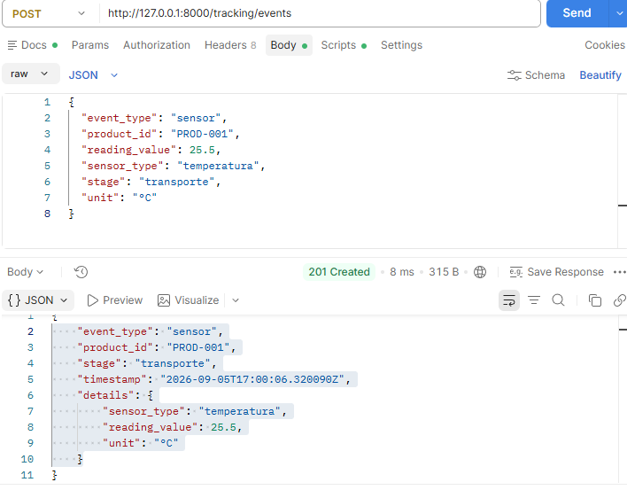

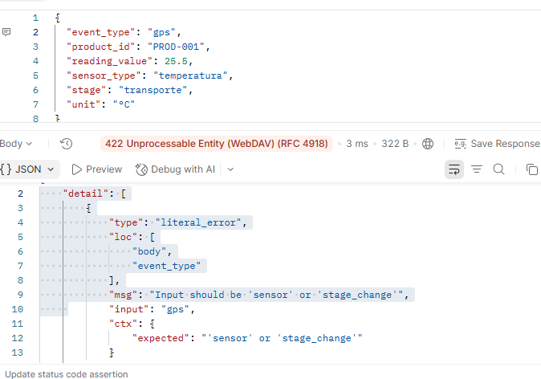

### Video explicativo
[Ver sustentación en video](https://youtu.be/NaDLKI6nF7g)
### Dónde se implementa
- **Puertos:** `src/tracking/domain/processing_ports.py`
- **Familias concretas:** `src/tracking/infrastructure/factories/`
- **Registro/selector:** `src/tracking/application/processing_factory_registry.py`
- **Integración:** `src/tracking/application/register_event.py`

### Cómo probarlo
```bash
POST http://127.0.0.1:8000/tracking/events
Content-Type: application/json

{
  "event_type": "sensor",
  "product_id": "PROD-001",
  "stage": "transporte",
  "sensor_type": "temperatura",
  "reading_value": 23.5,
  "unit": "°C"
}
```

```bash
POST http://127.0.0.1:8000/tracking/events
Content-Type: application/json

{
  "event_type": "stage_change",
  "product_id": "PROD-001",
  "stage": "transporte",
  "previous_stage": "fabricacion",
  "responsible": "Julian Nino"
}
```

### Justificación del patrón
Se usa Abstract Factory porque, para cada tipo de evento de tracking, el validador y el notificador deben ser mutuamente coherentes (por ejemplo, el validador de sensor nunca debe combinarse con el notificador de cambio de etapa). El registro selector permite agregar nuevos tipos de evento sin modificar el código existente, solo registrando una nueva familia concreta.

### Pendiente
- Endpoints CRUD de `products` para dejar de usar `product_id` "quemado" y consultarlo real desde la base de datos.
- Validar que el `product_id` exista antes de registrar un evento de tracking.
